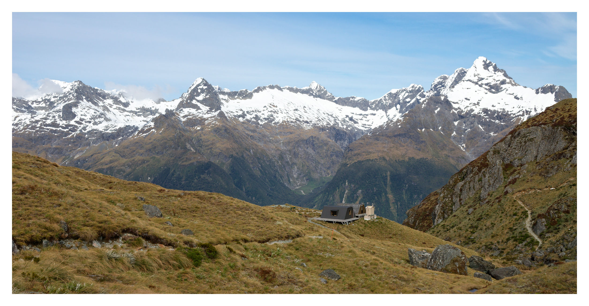
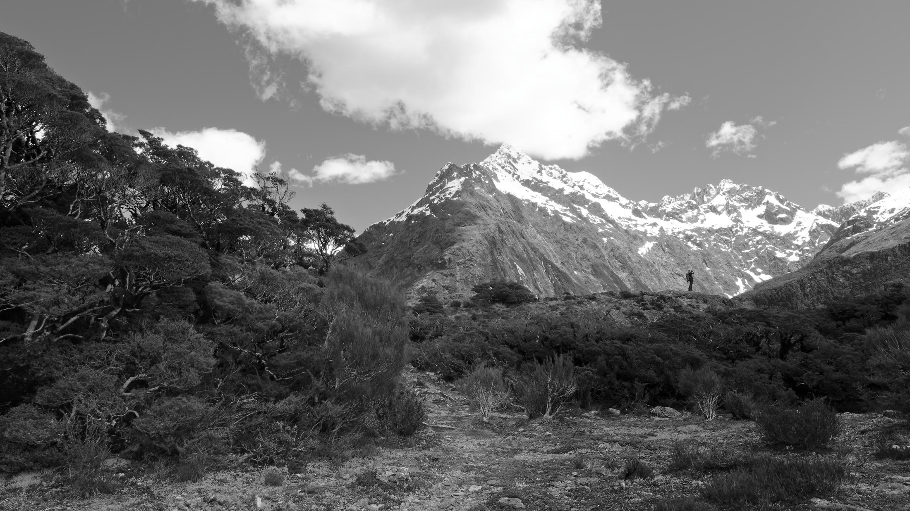
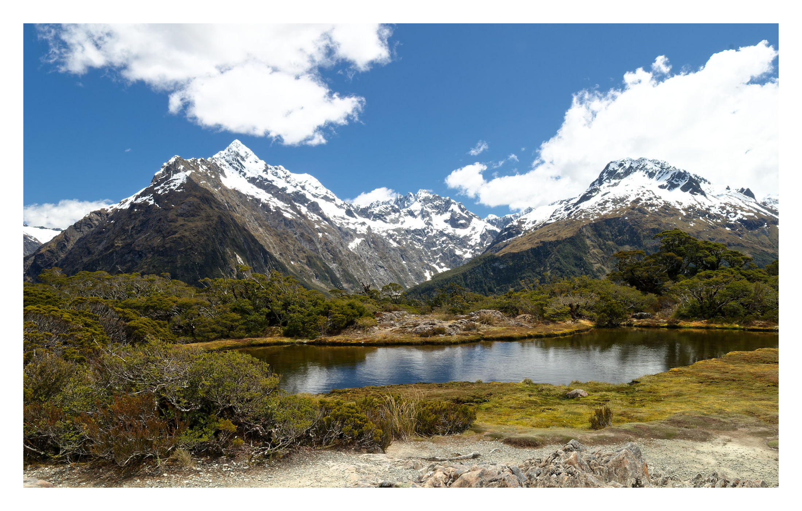

+++
title = "New Zealand: South Island Tramping"
date = '2016-11-01'
draft = false
layout = "simple"
+++


An overdue return to photography.




The frigid, rushing waters of this river - high up in the hills towards John Tait hut in the Nelson Lakes National Park - would lead you to believe that the day is cool and water plentiful when, in actuality, New Zealand is experiencing a scorching hot summer with air temperatures, even here in the mountains, pushing past 30 degrees. It is late November 2016 and I am traversing the hills that rise up above Lake Rotoiti, itself located at the Northern tip of the country's South Island. This trip is the third and final of my stay in New Zealand; it's the last multi-day hike I have time for before starting the long journey back to the UK and I intend to make it the most remote and self-supported so far.


And here you see my destination and stop for the night: Upper Travers Hut, nestled between mountains and looking out across a wide patch of open grassland that separates two segments of climbing; a welcome rest stop before continuing up and then *over* the next peaks and beginning the hike back to the lower lakes.

Of course, what they don't include on the tourist brochures is that this is, in fact, the *second* Upper Travers Hut, having been reconstructed in a slightly different location in 2004 after avalanche damage did the first one in. I would have slept worse had it not been the height of the summer months!


  
  
  


