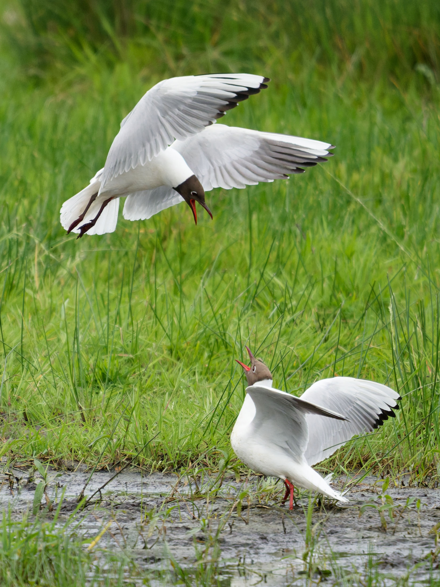
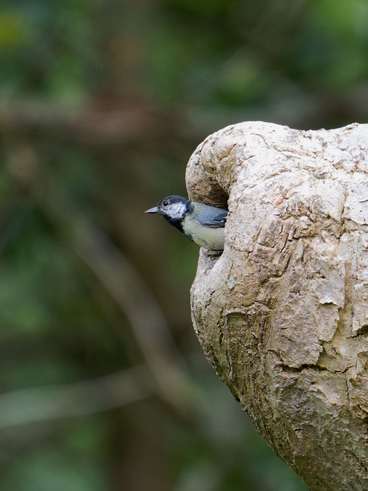
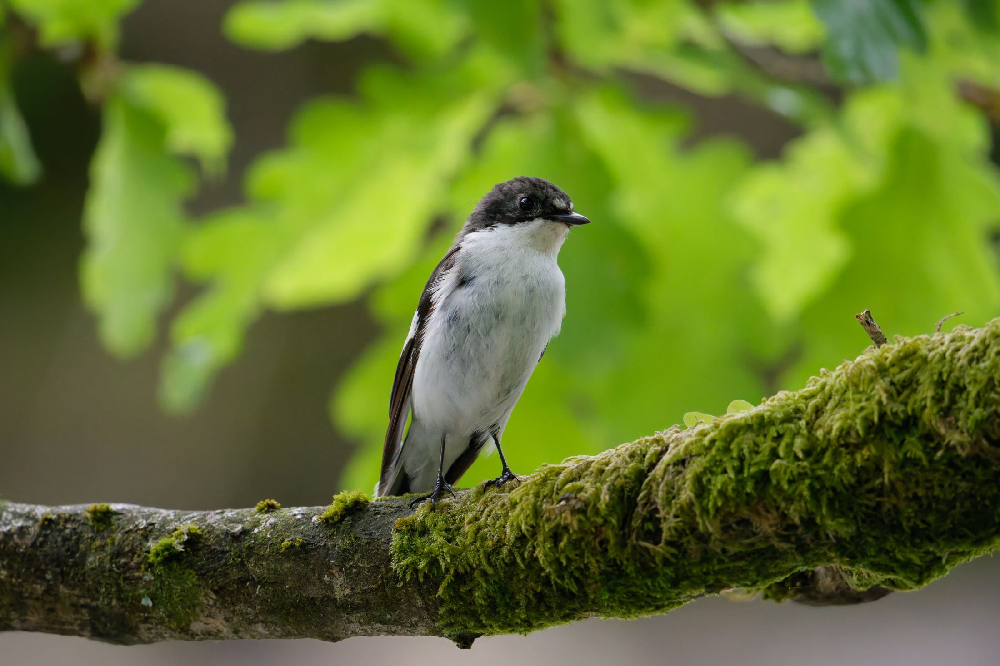

+++
title = "2021 Wildlife Roundup"
date = '2021-12-01'
draft = false
layout = "simple"
+++


 Sony A7R-IV 
 Sony 200-600 G 


In 2021, I rented the Sony 200-600 f/5.6-6.3 G lens from the always-excellent [Lenses for Hire](https://lensesforhire.co.uk) (no affiliation, just a happy customer), taking it to the Lake District for a week of walking and wildlife spotting around Borrowdale. The try-before-you-buy approach has saved me quite a bit of money in the past, having rented the Sony 16-35 f/2.8 GM, 24-70 f/2.8 GM and 28-70 f/2 GM and gone on to purchase *none* of them. With the 200-600 though, I was immediately impressed by its reach and, surprisingly, its utility for general landscape photography, too: a rocky forest outcrop at 500mm, or some tree branches around 300mm, for example.


  
  
  
  
  


