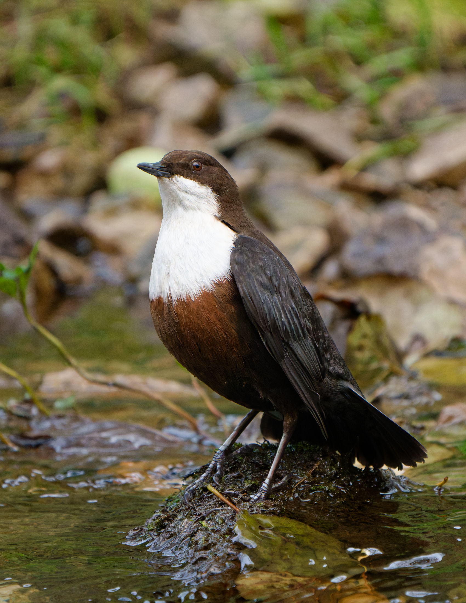

+++
title = "2022 Wildlife Roundup"
date = '2022-12-01'
draft = false
layout = "simple"
+++


 Sony A7R-IV 
 Sony 200-600 G 


2022 was a more local year, with most of these photos being taken along the River Cam, or in one of the local reserves such as Fowlmere and Kingfisher's Bridge. The two Dippers are from a brief trip to the Peak District.


  
  
  
  
  
  
  
  
  
  


